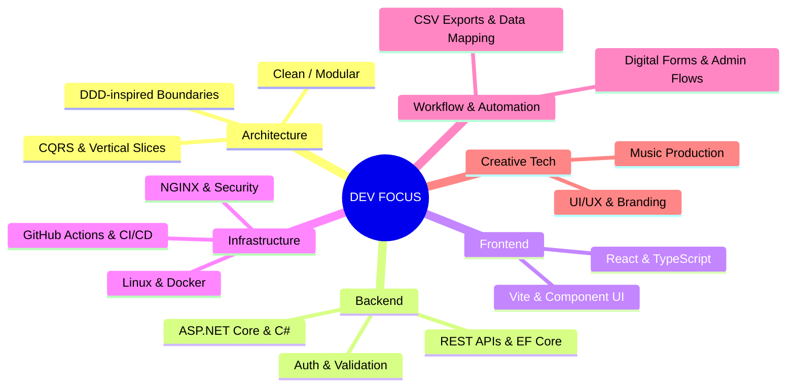

<!-- Original GitHub profile README by wizard-nazim | github.com/wizard-nazim -->

<table border="0" align="center">
  <tr>
    <td width="700" align="center" valign="top">
      <pre><code>Welcome to Nazim's Dev Space!</code></pre>
    </td>
  </tr>
</table>

 

<table border="0" align="center">
  <tr>
    <td width="260" align="center" valign="top">
       
      
        
      <strong>wizard-nazim</strong> 
      <code>full-stack dev</code>
        
      
        
      
      
        
      &nbsp;&nbsp;
      &nbsp;&nbsp;
      &nbsp;&nbsp;
        
      
    </td>
    <td width="440" align="left" valign="top">
       

<pre><code>curious about:
&gt; System Architecture &amp; Clean Boundaries
&gt; Backend APIs &amp; Domain-Driven Design
&gt; Infrastructure &amp; Linux Homelab
&gt; Security &amp; Networking Tools
&gt; Creative Tech — DAWs, UX/UI, Branding</code></pre>
 
<pre><code>engineering habits:
&gt; Build, lint &amp; test checks on every push
&gt; GitHub Actions automation &amp; CI before merge
&gt; Docs, diagrams &amp; architecture notes
&gt; Projects fail loudly before production</code></pre>
 
      

        
      

    </td>
  </tr>
</table>

<!-- ═══════════════════ NOW PLAYING ═══════════════════ -->

 
<table border="0" align="center">
  <tr>
    <td width="700" align="center" valign="top">
      <pre><code>currently listening to:</code></pre>
      
    </td>
  </tr>
</table>

<!-- ═══════════════════ CONTRIBUTION SNAKE ═══════════════════ -->

<table border="0" align="center">
  <tr>
    <td width="700" align="center" valign="top">
      <pre><code>contribution snake:
generated from wizard-nazim's GitHub activity</code></pre>
      <picture>
        <source
          media="(prefers-color-scheme: dark)"
          srcset="https://raw.githubusercontent.com/wizard-nazim/wizard-nazim/output/wizard-nazim-snake-dark.svg"
        />
        <source
          media="(prefers-color-scheme: light)"
          srcset="https://raw.githubusercontent.com/wizard-nazim/wizard-nazim/output/wizard-nazim-snake.svg"
        />
        
      </picture>
    </td>
  </tr>
</table>

 

<!-- ═══════════════════ TECH MINDMAP ═══════════════════ -->

 

<!-- ═══════════════════ FOOTER ═══════════════════ -->
<table border="0" align="center">
  <tr>
    <td width="500" align="center" valign="top">
      <pre><code>designed by wizard-nazim</code></pre>
    </td>
  </tr>
</table>
<!-- Original GitHub profile README by wizard-nazim | github.com/wizard-nazim -->
 
<!-- ═══════════════════ SILLY CATS ═══════════════════ -->

<table border="0" align="left">
  <tr>
    <td width="70" align="center" valign="top">
      

        
      

    </td>
  </tr>
</table>
<table border="0" align="right">
  <tr>
    <td width="70" align="center" valign="top">
      

        
      

    </td>
  </tr>
</table>

  <tr>
  
  </tr>

 

