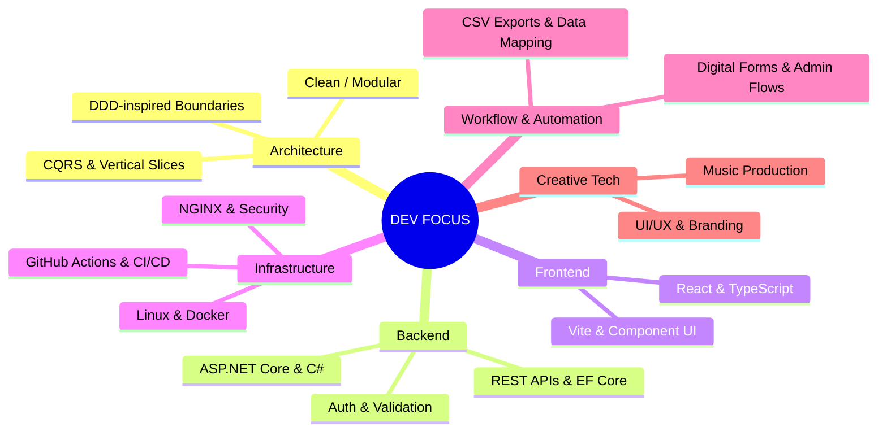

<!-- Original GitHub profile README by wizard-nazim | github.com/wizard-nazim -->

<table border="0" align="center">
  <tr>
    <td width="700" align="center" valign="top">
          <pre><code>Welcome to Nazim's Dev Space!</code></pre>
    </td>
  </tr>
</table>

 

<table border="0" align="center">
  <tr>
    <td width="700" align="center" valign="top">
      
    </td>
  </tr>
</table>

 

<table border="0" align="center">
  <tr>
    <td width="700" align="center" valign="top">
      

        <pre><code>My Website:</code></pre>
        

   
    

     
      https://desclution.vercel.app/
      
  </td>
  </tr>
</table>

 

<table border="0" align="center">
  <tr>
    <td width="260" align="center" valign="top">
       
      
        
      <strong>wizard-nazim</strong> 
      <code>full-stack dev</code>
        
      
        
      
      
        
      &nbsp;&nbsp;
      &nbsp;&nbsp;
      &nbsp;&nbsp;
        
      
    </td>
    <td width="440" align="left" valign="top">
       

<pre><code>curious about:
> System Architecture & Clean Boundaries
> Backend APIs & Domain-Driven Design
> Infrastructure & Linux Homelab
> Security & Networking Tools
> Creative Tech — DAWs, UX/UI, Branding</code></pre>
 
<pre><code>engineering habits:
> Build, lint & test checks on every push
> GitHub Actions automation & CI before merge
> Docs, diagrams & architecture notes
> Projects fail loudly before production</code></pre>
 

      

    </td>
  </tr>
</table>

<!-- ═══════════════════ NOW PLAYING ═══════════════════ -->

 
<table border="0" align="center">
  <tr>
    <td width="700" align="center" valign="top">
      <pre><code>currently listening to:</code></pre>

  

    </td>
  </tr>
</table>

<!-- ═══════════════════ CONTRIBUTION SNAKE ═══════════════════ -->

<table border="0" align="center">
  <tr>
    <td width="700" align="center" valign="top">
      <pre><code>contribution snake:
generated from wizard-nazim's GitHub activity</code></pre>
      <picture>
        <source
          media="(prefers-color-scheme: dark)"
          srcset="https://raw.githubusercontent.com/wizard-nazim/wizard-nazim/output/wizard-nazim-snake-dark.svg"
        />
        <source
          media="(prefers-color-scheme: light)"
          srcset="https://raw.githubusercontent.com/wizard-nazim/wizard-nazim/output/wizard-nazim-snake.svg"
        />
        
      </picture>
    </td>
  </tr>
</table>

 

<!-- ═══════════════════ TECH MINDMAP ═══════════════════ -->

```mermaid
mindmap
  root((DEV FOCUS))
    Architecture
      Clean / Modular
      CQRS & Vertical Slices
      DDD-inspired Boundaries
    Backend
      ASP.NET Core & C#
      REST APIs & EF Core
      Auth & Validation
    Frontend
      React & TypeScript
      Vite & Component UI
    Infrastructure
      Linux & Docker
      GitHub Actions & CI/CD
      NGINX & Security
    Workflow & Automation
      Digital Forms & Admin Flows
      CSV Exports & Data Mapping
    Creative Tech
      UI/UX & Branding
      Music Production
```

 

<!-- ═══════════════════ FOOTER ═══════════════════ -->

  <pre style="color: #67e8f9; font-size: 11px; margin: 0; letter-spacing: 1px; line-height: 1.5;"><code>@@@@@@@@@@@@@@@@@@@@@@@@@@@@@@@@@@@@@@@@@@@@@@@@@@@@@
@  designed by wizard-nazim • github.com/wizard-nazim  @
@@@@@@@@@@@@@@@@@@@@@@@@@@@@@@@@@@@@@@@@@@@@@@@@@@@@@</code></pre>

 

<!-- ═══════════════════ SILLY GIFS ═══════════════════ -->
<table border="0" align="left">
  <tr>
    <td width="70" align="center" valign="top">
      

        
      

    </td>
  </tr>
</table>

<table border="0" align="right">
  <tr>
    <td width="70" align="center" valign="top">
      

        
      

    </td>
  </tr>
</table>

<!--

  <tr>
  
  </tr>

 
-->
